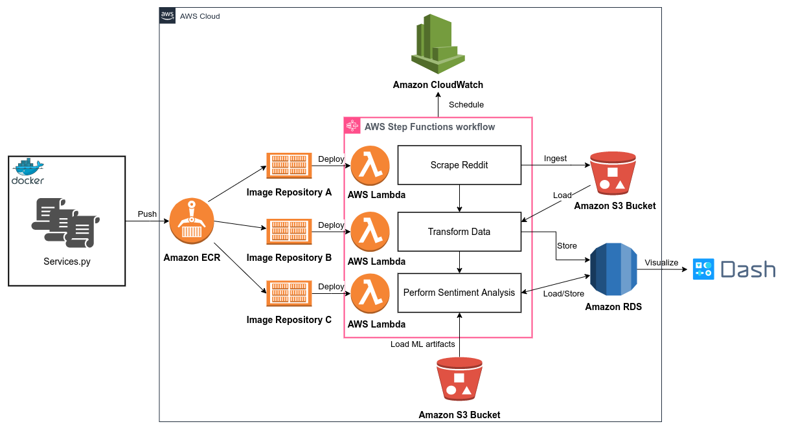
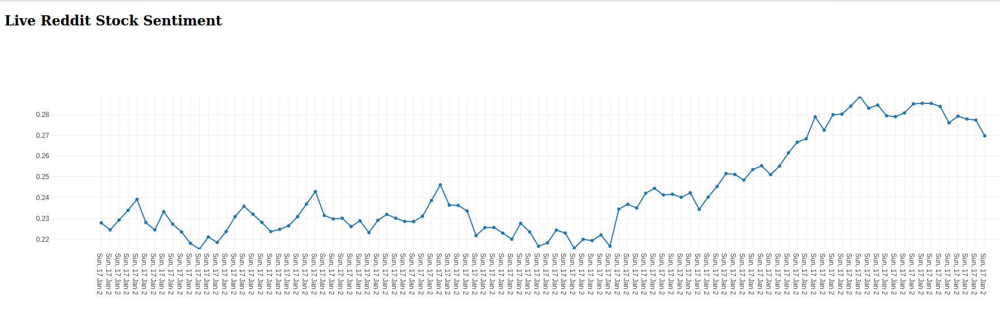

# Reddit Sentiment Analysis Pipeline

This is an end-to-end cloud pipeline to perform sentiment analysis of Reddit comments from [r/stocks](https://www.reddit.com/r/stocks/). 

## Architecture



1. Raw data is scraped from Reddit and loaded into a data lake ([Amazon S3](https://docs.aws.amazon.com/AmazonS3/latest/userguide/Welcome.html)).
2. Some data transformation is perfomed using [Pandas](https://pandas.pydata.org/docs/user_guide/index.html) and the cleaned data is put into a data warehouse ([PostgreSQL on Amazon RDS](https://docs.aws.amazon.com/AmazonRDS/latest/UserGuide/CHAP_PostgreSQL.html)).
3. A pretrained ML model is ran against the rows in the data warehouse and the results are stored into a table.
4. Finally, we run our [Dash](https://dash.plotly.com/) app to visualize the prediction scores as shown below.




All of the components are stored as Docker images in [Amazon ECR](https://docs.aws.amazon.com/AmazonECR/latest/userguide/what-is-ecr.html) repositories so that [AWS Lambda](https://docs.aws.amazon.com/lambda/latest/dg/welcome.html) can run the code. The whole pipeline is orchestrated and scheduled using [AWS Step Functions](https://docs.aws.amazon.com/step-functions/latest/dg/welcome.html) and [AWS CloudWatch](https://docs.aws.amazon.com/AmazonCloudWatch/latest/monitoring/WhatIsCloudWatch.html) (logs are included).

## Pre-requisites & Setup

1. [Docker](https://docs.docker.com/engine/install/) and [Docker Compose](https://docs.docker.com/compose/install/).
2. [AWS account](https://aws.amazon.com/).
3. [AWS CLI installed](https://docs.aws.amazon.com/cli/latest/userguide/install-cliv2.html) and [configured](https://docs.aws.amazon.com/cli/latest/userguide/cli-chap-configure.html).
4. IAM specific roles and policies are created.
5. S3 buckets, Lambda functions and RDS instance are all configured.

We use a [`Makefile`](Makefile) containing common commands.

Clone, create a virtual env, set up python path.

```bash
git clone https://github.com/jeremythai01/Reddit-Sentiment-Analysis-Pipeline.git
cd Reddit-Sentiment-Analysis-Pipeline
make setup
```

### CI Step

Run formatting, linting, layout checks, tests and build Docker images.

```bash
make ci
```

### CD Step

Push Docker images to ECR repositories and deploy to Lambda.

```bash
make cd
```